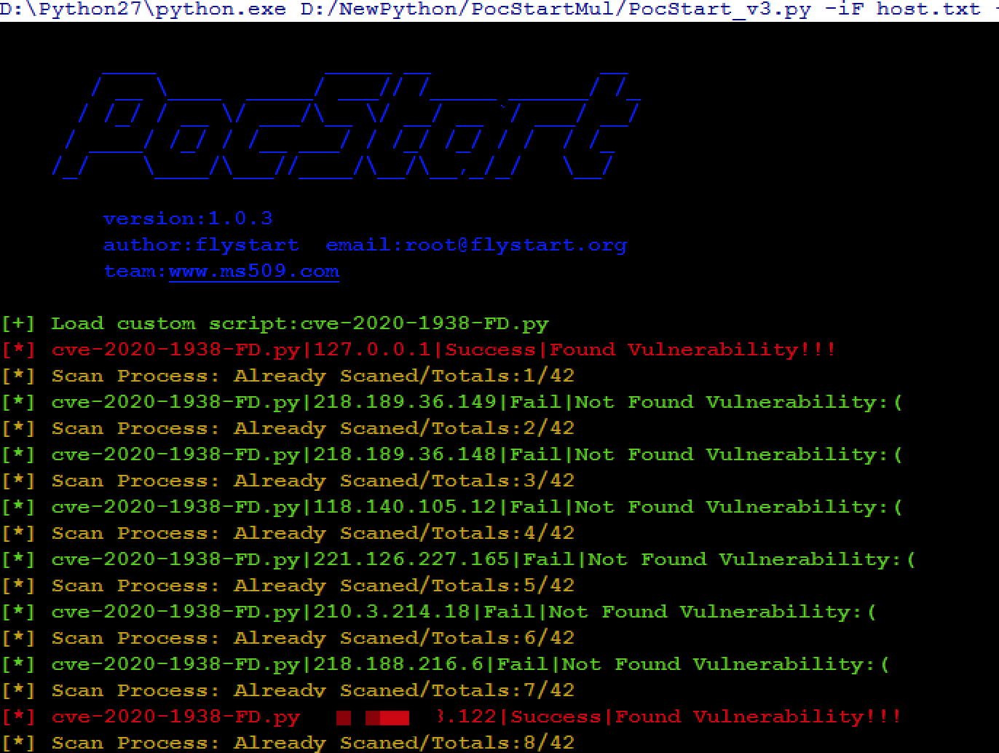

# PocStart
[](https://www.python.org/)[](https://www.python.org/)[](https://github.com/ggg4566/PocStart/blob/master/LICENSE)

轻量级多线程并发漏洞检测和利用框架，用于批量验证和利用漏洞，参考[**poc-t**](https://github.com/Xyntax/POC-T/)和 [**pocsuite**](https://github.com/knownsec/Pocsuite/).用户可根据自己喜好和需求进行二次开发。

---

开发环境： windows python3.6 

建议使用python3运行，python2官方已停止更新，后续新添加poc会使用python3开发



快速开始：
---


---
**使用手册**:
---

```
SCRIPT:
  -s NAME               load script by name (-s ./pocs/jobss) or path (-s
                        ./pocs/jboss.py)

TARGET:
  -iS TARGET            scan a single target (e.g. www.wooyun.org)
  -iF FILE              load targets from targetFile (e.g.
                        ./data/wooyun_domain)
  -p PORT               target port (e.g. 8080)
  -param POC Extra Param
                        extra poc param (e.g execute cmd | download file name,
                        only set a param)

OUTPUT:
  -o FILE               output file path&name. default in ./output/

SYSTEM:
  -h, --help            show this help message and exit

MODE:
  -m MODE               set verify mode[verify|attack]
  
python PocStart.py -iS http://localhost:8099/ -s TongdaOa/tongda_file_include.py 
python PocStart.py -iS http://localhost:8099/ -s TongdaOa/tongda_file_include.py  -m attack
python PocStart.py -iF urls.txt -s TongdaOa/ -t 10 -o out_result.txt

```

---

**特点:**
---

* 轻便小巧，无多余的第三方依赖库，可根据实际poc编写需要安装依赖库
* 用法简单，方便开发自己的poc

---

**开发**:
---

根据[pocs](https://github.com/ggg4566/PocStart/tree/master/pocs)目录下样例编写poc，只需要在特定的地方添加自己的代码即可，开发简单容易.

用户可以根据自己喜好修改框架满足自己的需求

```python	
#! /usr/bin/env python
# -*- coding:utf-8 -*-
# author:flystart
# home:www.flystart.org
# time:2020/4/26

import requests
import re
import string
import random

res = {}

def verify(target_node):
    target = target_node['target']
    url = target + '/ispirit/im/upload.php'
    res = {}
    res['Info'] = ""
    res['Success'] = False
         '''your code.'''
    if _keyword in response_text:
          res['Info'] = 'FOUNDED VULNERABILTY!!!'
          res['Success'] = True
    return res


def attack(target_node):
    target = target_node['target']
    url = target + '/ispirit/im/upload.php'
    res = {}
    res['Info'] = ""
    res['Success'] = False
        '''your code.'''
    response = sess.get(url)
    if 200 == response.status_code:
        res['Info'] = 'Shell_URL:%s'%(url)
        res['Success'] = True
    return res

```


